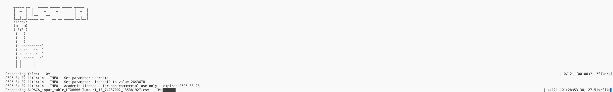

# ALPACA
```
     _____ __    _____ _____ _____ _____
    |  _  |  |  |  _  |  _  |     |  _  |
    |     |  |__|   __|     |   --|     |
    |__|__|_____|__|  |__|__|_____|__|__|
    /\⌒⌒⌒/\
    (⦿   ⦿)
    ( 'Y' )
     (   )
     (   )
     (   )
     (~ ~~~~~~~~~~)
     ( ~ ~~   ~~  )
     ( ~  ~ ~  ~  )
     (~  ~~~~~   ~)
     │ │      │ │
     │ │      │ │
```
Repository containing core ALPACA code

<!-- TOC start (generated with https://github.com/derlin/bitdowntoc) -->

- [ALPACA](#alpaca)
   * [Getting started](#getting-started)
      + [Installation](#installation)
      + [Testing installation](#testing-installation)
   * [Tutorial](#tutorial)
      + [Required inputs](#required-inputs)
         - [1. Fractional copy-numbers for each sample and each genomic segment](#1-fractional-copy-numbers-for-each-sample-and-each-genomic-segment)
         - [2. Confidence intervals associated with each allele-specific fractional copy-number](#2-confidence-intervals-associated-with-each-allele-specific-fractional-copy-number)
         - [3. Clone proportions table](#3-clone-proportions-table)
         - [4. Phylogenetic tree](#4-phylogenetic-tree)
      + [Example input file structure](#example-input-file-structure)
   * [Running ALPACA](#running-alpaca)
      + [Generating ALPACA input from BAM files](#generating-alpaca-input-from-bam-files)
      + [Running ALPACA using CONIPHER and Refphase outputs](#running-alpaca-using-conipher-and-refphase-outputs)
      + [Running ALPACA](#running-alpaca-1)
      + [Available options](#available-options)

<!-- TOC end -->


<!-- TOC --><a name="getting-started"></a>
## Getting started

<!-- TOC --><a name="installation"></a>
### Installation

Start by cloning this repository:

```bash
git clone https://github.com/McGranahanLab/ALPACA-model.git
cd ALPACA-model
```

ALPACA is implemented in python - the easiest way to install all the required dependencies is to use 'alpaca_conda.yml':

```bash
conda env create --name alpaca --file environment.yml
```

Next, install ALPACA with pip:

```bash
conda run -n alpaca pip install dist/*.whl
```

ALPACA is using Gurobi solver - please obtain free academic license before running the model at [Gurobi](https://www.gurobi.com/academia/academic-program-and-licenses)

<!-- TOC --><a name="testing-installation"></a>
### Testing installation

To ensure that ALPACA works correctly after installation, activate the environment:

```bash
conda activate alpaca
```

then run:

```bash
bash examples/run_example.sh
```

This command should create output these output files:

```bash
ALPACA-model/examples/example_cohort/output/LTX0000-Tumour1
├── cn_change_to_ancestor.csv
└── final_LTX0000-Tumour1.csv
```

<!-- TOC --><a name="tutorial"></a>
## Tutorial

<!-- TOC --><a name="required-inputs"></a>
### Required inputs

This section describes inputs required by ALPACA. If you are using CONIPHER and Refphase as input to ALPACA, these input will be generated automatically see section [Running ALPACA using CONIPHER and Refphase outputs](#running-alpaca-using-conipher-and-refphase-outputs) below. Input for each tumour should be stored in a separate directory, i.e. each of the input tables should only contain data obtained from a single tumour.

<!-- TOC --><a name="1-fractional-copy-numbers-for-each-sample-and-each-genomic-segment"></a>
#### 1. Fractional copy-numbers for each sample and each genomic segment

These should be stored in a data frame with the following columns:

|segment|sample|cpnA|cpnB|tumour_id|
|--------|--------|--------|--------|--------|
|1_6204266_6634901|U_LTX0000_SU_T1.R1|3.2|2.0|LTX0000|
|1_6204266_6634901|U_LTX0000_SU_T1.R2|3.3|2.3|LTX0000|
|1_6204266_6634901|U_LTX0000_SU_T1.R3|3.4|2.0|LTX0000|

The table above shows the input for one genomic segment located on chromosome 1, starting at the base 6204266 and ending at 6634901 (encoded in the segment name as `<chr>_<start>_<end>`). Column 'sample' contains sample names of the tumour: this example contains 3 different samples (R1, R2 and R3) obtained from a single tumour (`U_LTX0000_SU_T1`). The sample names are arbitrary, but must be coherent within the entire input (including other input files). Fractional, allele-specific copy-numbers are stored in columns `cpnA` and `cpnB` and lastly column `tumour_id` stores the identifier of the tumour.

The segments are stored in the `ALPACA_input_table.csv` file

IMPORTANT

Pay special attention to underscore `_` character - it is used by ALPACA during file parsing and its usage must conform to the example pattern shown above. Do not use it in your tumour identifier.

<!-- TOC --><a name="2-confidence-intervals-associated-with-each-allele-specific-fractional-copy-number"></a>
#### 2. Confidence intervals associated with each allele-specific fractional copy-number

This table (called `ci_table.csv`) is similar to the ALPACA_input_table but contains lower and upper confidence intervals for each genomic segment.

|segment|sample|lower_CI_A|upper_CI_A|lower_CI_B|upper_CI_B|tumour_id|ci_value|
|--------|--------|--------|--------|--------|--------|--------|--------|
|10_38599060_42906137|LTX0000_SU_T1-R1|3.218|4.196|2.200|3.085|LTX0000|0.5|
|10_38599060_42906137|LTX0000_SU_T1-R2|1.468|1.695|2.703|2.977|LTX0000|0.5|

<!-- TOC --><a name="3-clone-proportions-table"></a>
#### 3. Clone proportions table

Table containing cellular prevalence of each clone in each sample, saved as comma separated file under the name `cp_table.csv`. This can be derived from cancer cell fractions (CCF), for example by subtracting the CCF values of children clones from CCF values of their parents. CONIPHER contains `compute_subclone_proportions` function which can be adapted to output the clone proportions.
This table contains an index column specifying clone names (which must match the name of clones in phylogenetic tree - see below) and one column for each sample. Proportions should sum to 1 in each sample, but small deviations from 1 are tolerated.

|clone|U_LTX0000_SU_T1.R1|U_LTX0000_SU_T1.R2|U_LTX0000_SU_T1.R3|
|--------|--------|--------|--------|
|clone1|0.0309|0.0006|0.1383|
|clone12|0.2810|0.0|0.0|
|clone13|0.0|0.0253|0.1112|
|clone14|0.1557|0.0|0.0021|
|clone15|0.0|0.0|0.1598|
|clone19|0.0|0.4785|0.2534|
|clone20|0.0202|0.4460|0.3176|
|clone21|0.0684|0.0|0.0174|
|clone8|0.4434|0.0495|0.0|
|clone16|0.0|0.0|0.0|
|clone18|0.0|0.0|0.0|

<!-- TOC --><a name="4-phylogenetic-tree"></a>
#### 4. Phylogenetic tree

A json file (named `tree_paths.json`) containing the SNV tree structured encoded as an array of arrays - each of the sub-arrays represents the phylogenetic path from the trunk (most recent common ancestor) to a terminal clone (leaf). For example, consider a simple tree with MRCA and three subclones. Subclones A and B are direct descendants of MRCA, and clone C is the child of clone B:

```
       MRCA
       ├── A
       └── B
           └── C

```

Such tree would be encoded as following in ALPACA format:

```json
[['MRCA','A'],['MRCA','B','C]]
```

A more complex tree, with name of clones consistent with names used in the `cp_table.csv` above would look like this:

```json
[["clone12", "clone13", "clone14", "clone8"], ["clone12", "clone13", "clone14", "clone15"], ["clone12", "clone13", "clone16", "clone18", "clone1"], ["clone12", "clone19", "clone20"], ["clone12", "clone19", "clone21"]]
```

<!-- TOC --><a name="example-input-file-structure"></a>
### Example input file structure

Overall, for each tumour we expect the following files:

```bash
LTX0000
├── ALPACA_input_table.csv
├── ci_table.csv
├── cp_table.csv
└── tree_paths.json
```

<!-- TOC --><a name="running-alpaca"></a>
## Running ALPACA

<!-- TOC --><a name="generating-alpaca-input-from-bam-files"></a>
### Generating ALPACA input from BAM files

For a tutorial on running ALPACA from BAM files, please see the tutorial at: [ALPACA pipeline](https://github.com/McGranahanLab/ALPACA-pipeline)

<!-- TOC --><a name="running-alpaca-using-conipher-and-refphase-outputs"></a>
### Running ALPACA using CONIPHER and Refphase outputs

We recommend using [CONIPHER](https://github.com/McGranahanLab/CONIPHER/blob/main/README.md) and [Refphase](https://bitbucket.org/schwarzlab/refphase/src/master/) outputs to generate input to ALPACA.

CONIPHER output directory should contain a 'tree object' for each patient. This object is save as RDS file with the following name: <CASE_ID>.tree.RDS

Refphase aggregates all outputs in one object:

```R
results <- refphase(refphase_input)
```

Make sure that this entire object is saved as a single RData object, for example by adding this code to your Refphase script:

```R
results <- refphase(refphase_input)
save(results, file = paste0(patient, "-refphase-results.RData"))
```

This is how your input directory for a single tumour should look like:

```bash
LTX000
├── LTX0000-refphase-results.RData
└── LTX0000.tree.RDS
```

Using these two files, run the input_conversion command which should be available in your system after installing ALPACA.

E.g.:

```bash
tumour_id="LTX000"
refphase_rData="examples/simple_pipeline/${tumour_id}/refphase/${tumour_id}-refphase-results.RData"
CONIPHER_tree_object="examples/simple_pipeline/${tumour_id}/conipher/output/${tumour_id}.tree.RDS"
output_dir="examples/simple_pipeline/${tumour_id}/alpaca/input"

input_conversion \
    --tumour_id $tumour_id \
    --refphase_rData $refphase_rData \
    --CONIPHER_tree_object $CONIPHER_tree_object \
    --output_dir $output_dir
    
```

Make sure that your 'tumour_id' is the same as 'CASE_ID' in CONIPHER output and as 'patient_tumour' in Refphase output.

Converting the input might take a while and you will see this output while the program runs:

```bash
Tumour ID: LTX0000
Running input_conversion - it may take a few minutes
Argument 4 (examples/example_cohort/input/LTX0000/LTX0000-refphase-results.RData): Exists
Argument 6 (examples/example_cohort/input/LTX0000/LTX0000.tree.RDS): Exists
Argument 8 (examples/example_cohort/input/LTX0000): Exists
/Users/pp/miniforge3/envs/main/lib/python3.13/site-packages/alpaca/scripts/submodules/alpaca_input_formatting/input_conversion.sh
```

<!-- TOC --><a name="running-alpaca-1"></a>
### Running ALPACA

Once input is generated, ALPACA can be run with:

```bash
alpaca run \
    --input_tumour_directory "${input_tumour_directory}" \
    --output_directory "${output_directory}"
```

Your input_tumour_directory should look like this:

```bash
LTX000
├── ALPACA_input_table.csv
├── ci_table.csv
├── cp_table.csv
└── tree_paths.json
```

but if you started from CONIPHER and Refphase, intermediary input files will also be present:

```bash
├── ALPACA_input_table.csv  <- ALPACA input
├── LTX0000-refphase-results.RData <- Refphase input
├── LTX0000.tree.RDS  <- CONIPHER input
├── ci_table.csv  <- ALPACA input
├── cp_table.csv  <- ALPACA input
├── phased_segs.tsv <- Intermediary input files
├── phased_snps.tsv <- Intermediary input files
├── purity_ploidy.tsv <- Intermediary input files
└── tree_paths.json  <- ALPACA input
```

Once ALPACA starts running, you will see the logo and the progress bar:



ALPACA operates sequentially on each genomic segment. During this process, the `ALPACA_input_table.csv` will be decomposed into separate segment files for each segment so you will see additional `segments` directory in your input directory:

```bash
├── ALPACA_input_table.csv
├── LTX0000-refphase-results.RData
├── LTX0000.tree.RDS
├── ci_table.csv
├── cp_table.csv
├── phased_segs.tsv
├── phased_snps.tsv
├── purity_ploidy.tsv
├── segments
│   ├── ALPACA_input_table_LTX0000_10_38599060_42906137.csv
│   ├── ALPACA_input_table_LTX0000_10_42906138_45934831.csv
│   ├── ALPACA_input_table_LTX0000_10_45934832_74237001.csv
│   ├── ALPACA_input_table_LTX0000_10_74237002_135381927.csv
│   ├── ALPACA_input_table_LTX0000_10_95074_38406884.csv
│   ├── ALPACA_input_table_LTX0000_11_17317215_44596409.csv
└── tree_paths.json  <- ALPACA input
```

Solution for each segment is saved in the output directory. While the programme is running, you will see that output directory is populated with separate solution files:

```bash
ALPACA-model/examples/example_cohort/output/LTX0000
├── optimal_LTX0000_10_38599060_42906137.csv
├── optimal_LTX0000_10_42906138_45934831.csv
├── optimal_LTX0000_10_45934832_74237001.csv
├── optimal_LTX0000_10_74237002_135381927.csv
├── optimal_LTX0000_10_95074_38406884.csv
├── optimal_LTX0000_11_17317215_44596409.csv
├── optimal_LTX0000_11_193863_2164677.csv
├── optimal_LTX0000_11_2164678_3249658.csv
├── optimal_LTX0000_11_3249659_17317214.csv
└── optimal_LTX0000_11_44596410_49598207.csv
```

Once all the segments are done, these intermediary files are concatenated into single output files and deleted. The final output for a single tumour will contain two files:

```bash
ALPACA-model/examples/example_cohort/output/LTX0000
├── cn_change_to_ancestor.csv
└──final_LTX0000.csv
```

`final_LTX0000.csv` contains the clone-specific copy-numbers for both alleles:

|tumour_id|segment|clone|pred_CN_A|pred_CN_B|
|--------|--------|--------|--------|--------|
|LTX0000|2_41509_27282430|clone17|2|1|
|LTX0000|2_41509_27282430|clone20|2|1|
|LTX0000|2_41509_27282430|clone14|1|2|
|LTX0000|2_41509_27282430|clone9|1|1|
|LTX0000|2_41509_27282430|clone15|3|1|

`cn_change_to_ancestor.csv` contains the information on the copy number change between each clone and its ancestor:

|tumour_id|segment|clone|pred_CN_A|pred_CN_B|parent|parent_pred_cpnA|parent_pred_cpnB|cn_dist_to_parent_A|cn_dist_to_parent_B|
|--------|--------|--------|--------|--------|--------|--------|--------|--------|--------|
|LTX0000|2_41509_27282430|clone17|2|1|clone6|2|1|0|0|
|LTX0000|2_41509_27282430|clone20|2|1|clone4|3|1|-1|0|
|LTX0000|2_41509_27282430|clone14|1|2|clone1|1|2|0|0|
|LTX0000|2_41509_27282430|clone9|1|1|clone2|1|1|0|0|
|LTX0000|2_41509_27282430|clone15|3|1|clone11|2|1|1|0|

<!-- TOC --><a name="available-options"></a>

### Available options

```bash
--overwrite_output <value>
```

Controls whether ALPACA overwrites existing temporary files.
Allowed values: 0 (do not overwrite, default), 1 (overwrite).

In the default 'tumour' mode, ALPACA iterates sequentially over each segment, saving temporary .csv tables with solutions for each. It then concatenates all segment solutions into one final output file. On systems with time constraints, if ALPACA isn't allocated enough time, the run might be incomplete, resulting in only some segment solutions being present, but not the final file. In such situations, if the user restarts ALPACA, it will begin from scratch and overwrite all previously created files. To reuse these files, run ALPACA with the --overwrite_output 1 option. The default setting for this option is --overwrite_output 0 to prevent unintended reuse of temporary files.

